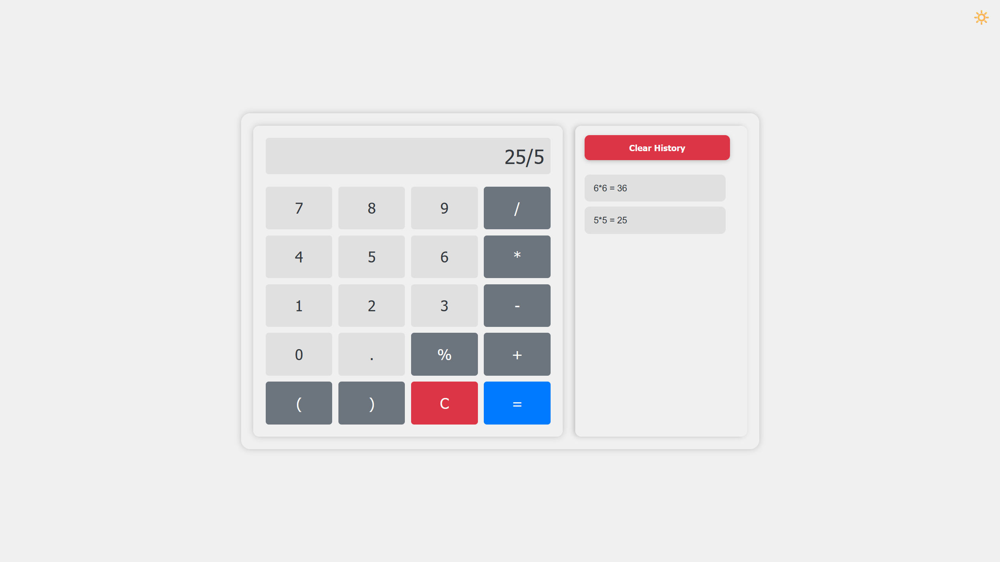
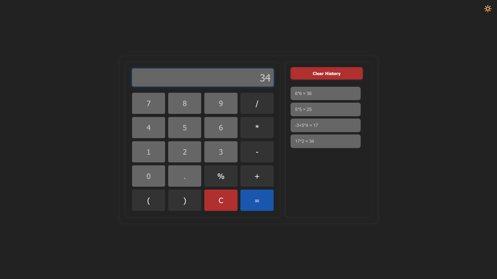

# Most advanced Latvian calculator

Vanilla JavaScript calculator with basic arithmetic operations, history of calculations, and keyboard support. The
calculator has a responsive design and supports both light and dark themes.

Preview is available [here](https://lvca.pages.dev/).

## Features

- [x] Basic arithmetic operations
- [x] History of calculations in `local storage`
- [x] Validation of input on the fly
- [x] Dark and light themes
- [x] Keyboard support, including history navigation
- [x] Responsive design
- [ ] Latvian language support (isn't planned)
- [ ] Display of intermediate results
- [ ] Editable input field with cursor support

Light theme:


Dark theme:


## Installation

1. Clone the repository
    ```bash
    git clone https://github.com/R-udren/calculator.git 
    ```
2. Navigate to the project directory
    ```bash
    cd calculator
    ```
3. Install the dependencies
    ```bash
    npm install
    ```
4. Start the development server
    ```bash
    npm run dev
    ```
5. Build the production-ready files
    ```bash
    npm run build
    ```
6. Preview the built app (optional, ensures everything works as expected after the build)
    ```bash
    npm run preview
    ```

## Usage

- Use the calculator as you would any other calculator
- Use the keyboard to navigate the calculator and history
    - `Enter` or `=` to calculate
    - `ArrowUp` and `ArrowDown` to navigate history
    - `Backspace` or `Delete` to delete the last character
    - `Escape`, `C`, `Ctrl + Backspace` to clear the input
    - `Ctrl + c` to copy the result to the clipboard

